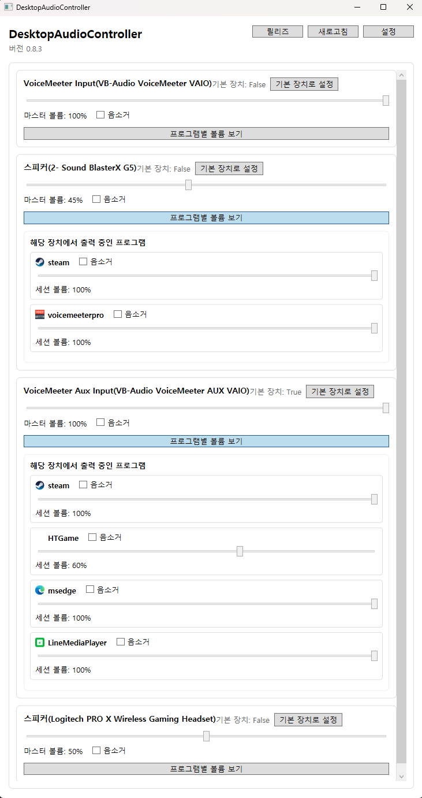

# DesktopAudioController

Windows에서 사용자가 고른 출력 장치만 표시하고, 장치 마스터 볼륨과 해당 장치에서 실제로 소리를 내는 프로그램별 세션 볼륨을 빠르게 제어하는 WPF 데스크톱 유틸리티입니다.

## 실행 화면 예시



## 현재 상태

```text
기준 버전: v0.10.1
개발 단계: Phase 10-2 완료 / Phase 10-3 준비
런타임: .NET 8 / WPF / Windows 전용
배포 형태: win-x64 self-contained single-file zip
최신 프리릴리즈: https://github.com/TailFox-Forge/DesktopAudioController/releases/tag/v0.10.1
최근 확인 사항:
- 프로그램 설정 저장 debounce 적용 완료
- 트레이 우클릭 종료 시 프로세스 잔류 대응 반영 완료
- SettingsService / 프로그램 설정 저장 복원 테스트 9개 통과
- Phase 9 범위 종료 및 portable zip 배포 기준 확정
- 앱 내 새 버전 감지 및 zip 다운로드 링크 안내 추가
- 오디오 이벤트 큐 / settings I/O / 트레이 메뉴 갱신 경로 안정화 반영
- 업데이트 방식은 zip 다운로드 후 압축 해제 / 덮어쓰기 기준
```

## 프로그램 동작 방식

### 1. 앱 시작

```text
- 시작 시 settings.json을 로드합니다.
- 설정 파일이 손상되어 있으면 기존 파일을 settings.json.bak로 백업하고 기본값으로 복구합니다.
- 최초 실행이거나 표시할 장치를 아직 고르지 않았으면 설정창을 먼저 엽니다.
- RunAtWindowsStartup가 켜져 있으면 시작 시 자동 실행 레지스트리 상태를 다시 맞춥니다.
- 로그 파일은 앱 시작과 함께 초기화됩니다.
```

### 2. 메인 화면

```text
- 설정에서 선택한 출력 장치만 메인 화면에 표시합니다.
- ShowOnlyConnectedDevices가 켜져 있으면 연결된 장치만 보여줍니다.
- 각 장치 카드에서 마스터 볼륨, 음소거, 기본 출력 장치 전환을 수행할 수 있습니다.
- 기본 장치는 화면 갱신 시 자동으로 눈에 띄게 반영됩니다.
```

### 3. 장치 / 세션 제어

```text
- 장치 마스터 볼륨 변경은 약 80ms debounce 후 실제 오디오 서비스에 반영됩니다.
- 장치 음소거는 즉시 반영됩니다.
- 장치를 펼치면 해당 장치에서 현재 활성인 프로그램 세션 목록을 표시합니다.
- 프로그램 세션에서도 볼륨 / 음소거를 각각 제어할 수 있습니다.
- 세션 볼륨 변경 역시 약 80ms debounce 후 실제 오디오 서비스에 반영됩니다.
- 이름이 같은 프로그램이 여러 개면 경로나 세션 힌트로 표시명을 구분합니다.
- 시스템 사운드 세션은 옵션으로 포함하거나 숨길 수 있습니다.
```

### 4. 프로그램별 설정 저장 / 복원

```text
- 프로그램별 볼륨 / 음소거 상태를 저장합니다.
- 저장 키는 가능한 경우 실행 파일 경로 기반으로 잡고, 필요하면 세션 경로 또는 표시명으로 보정합니다.
- 세션 슬라이더를 짧게 여러 번 움직여도 설정 파일 저장은 마지막 입력 기준 약 400ms 뒤 1회만 수행됩니다.
- 설정창을 열기 직전과 앱 종료 직전에는 pending 저장을 즉시 flush합니다.
- 살아 있는 세션이 다시 보이면 저장된 프로그램 설정을 자동 복원합니다.
```

### 5. 자동 갱신

```text
- 오디오 장치 / 세션 / 상태 변경 이벤트를 받아 화면을 자동 갱신합니다.
- 상태 변화만 있으면 부분 갱신으로 처리하고, 장치 구조 변화가 있으면 전체 갱신으로 전환합니다.
- 앱 아이콘과 프로세스 메타데이터는 캐시를 사용해 반복 조회 비용을 줄입니다.
- GitHub 릴리즈 확인은 백그라운드에서 수행하며 UI를 멈추지 않도록 짧은 timeout과 예외 무시 정책을 사용합니다.
- 새 버전이 있으면 상단에 최신 버전 안내를 표시하고, zip 다운로드 링크를 바로 여는 업데이트 버튼을 노출합니다.
- 실제 적용은 자동 패치가 아니라 zip 다운로드 후 기존 실행 폴더 덮어쓰기 방식입니다.
```

### 6. 트레이 동작

```text
- MinimizeToTray가 켜져 있으면 창 닫기 시 종료 대신 트레이로 숨깁니다.
- 트레이 메뉴에서 창 열기, 설정 열기, 새로고침, 기본 장치 빠른 전환, 장치 음소거 토글, 종료를 실행할 수 있습니다.
- v0.8.3부터 트레이 종료는 Shutdown 단독 호출이 아니라 메인 창 Close 경로를 타도록 변경했습니다.
- 이 경로에서 종료 직전 pending 설정을 flush하고 WPF 종료 파이프라인을 정상적으로 통과합니다.
```

## 설정 항목

```text
- 표시할 출력 장치 선택
- 시작 시 최소화
- Windows 시작 시 자동 실행
- 트레이로 최소화
- 연결된 장치만 표시
- 시스템 사운드 세션 표시
```

## 저장 파일과 로그

설정 파일:

```text
%LocalAppData%\DesktopAudioController\settings.json
%LocalAppData%\DesktopAudioController\settings.json.bak
```

진단 로그:

```text
%LocalAppData%\DesktopAudioController\logs\DesktopAudioController-YYYYMMDD.log
```

로그에서 바로 확인할 수 있는 대표 항목:

```text
- 설정 로드 / 저장 경로
- 프로그램 설정 저장 완료 count=...
- 저장된 프로그램 설정 복원
- 트레이 종료 요청 처리
- OnExit 시작 / OnExit 완료
```

## 기술 스택

```text
- C#
- .NET 8
- WPF
- Windows Forms NotifyIcon
- Windows Core Audio API + NAudio
- PolicyConfig COM interop
```

## 프로젝트 구조

```text
DesktopAudioController/
  docs/
    design.md
    release-notes-template.md
  scripts/
    publish-win-x64.sh
  src/
    DesktopAudioController/
      Models/
      Services/
      ViewModels/
      Views/
      App.xaml.cs
      DesktopAudioController.csproj
```

## 빌드

Windows 또는 Windows 타겟팅이 가능한 환경에서 실행합니다.

```bash
dotnet restore src/DesktopAudioController/DesktopAudioController.csproj -p:EnableWindowsTargeting=true
dotnet build src/DesktopAudioController/DesktopAudioController.csproj -p:EnableWindowsTargeting=true
```

최근 기준 빌드 검증:

```text
Build succeeded.
0 Warning(s)
0 Error(s)
```

## 배포

win-x64 self-contained single-file zip 생성 스크립트:

```bash
bash scripts/publish-win-x64.sh v0.10.1-local
```

스크립트가 수행하는 작업:

```text
1. RID restore
2. Release publish
3. zip 패키지 생성
4. sha256 체크섬 생성
```

산출물 경로:

```text
artifacts/release/win-x64/<version>/publish/
artifacts/release/packages/DesktopAudioController-<version>-win-x64.zip
artifacts/release/packages/DesktopAudioController-<version>-win-x64.zip.sha256
```

업데이트 방식:

```text
1. 새 zip 다운로드
2. 압축 해제
3. 기존 실행 폴더에 파일 덮어쓰기
4. settings.json / logs 는 %LocalAppData%\DesktopAudioController 경로에 유지
```

## 문서 / 릴리즈

- [설계 문서](docs/design.md)
- [릴리즈 노트 템플릿](docs/release-notes-template.md)
- [GitHub Releases](https://github.com/TailFox-Forge/DesktopAudioController/releases)

## 라이선스

```text
MIT License
```

자세한 내용은 [LICENSE](LICENSE)를 따릅니다.

## 진행 현황

### Phase 9 완료 항목

```text
1. LICENSE 반영 및 Public 전환 준비
2. 자동 테스트 추가
3. portable zip 배포 기준 확정
```

### Phase 10 진행 현황

```text
1. P10-1 업데이트 체계 고도화 완료
2. P10-2 장시간 안정화 1차 완료
3. P10-3 UX 마감 예정
```
